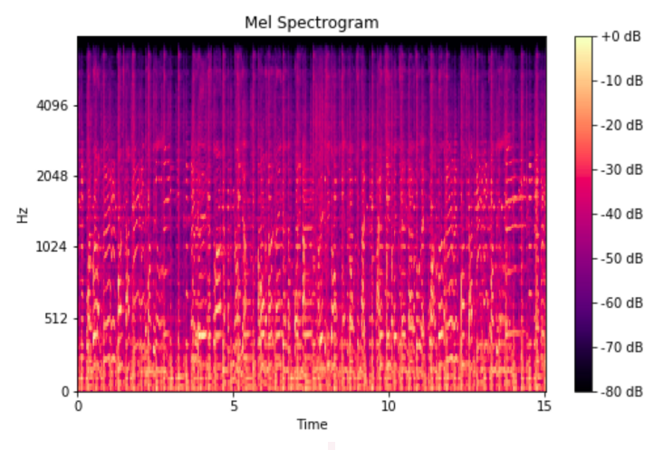
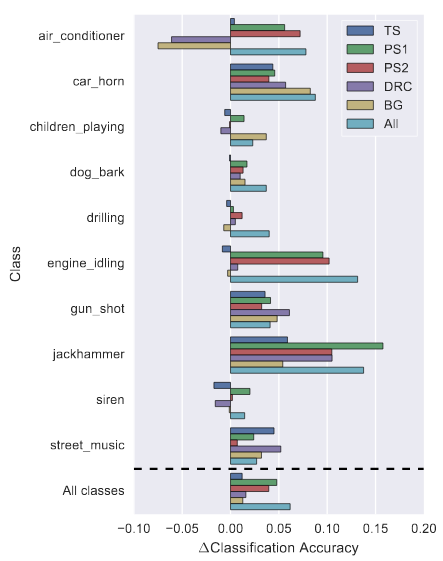

# Recherches - Deep Convolutional Neural Networks and Data Augmentation for Environmental Sound Classification

## Références principales 

- Salamon, Justin, and Juan Pablo Bello. *“Deep Convolutional Neural Networks and Data Augmentation for Environmental Sound Classification.”* IEEE Signal Processing Letters 24.3 (2017): 279–283. Crossref. Web.

- Environmental Sound Classification Using Deep Learning - [Github](https://github.com/mariostrbac/environmental-sound-classification)

- Neil Zeghidour and Olivier Teboul and Félix de Chaumont Quitry and Marco Tagliasacchi. *"LEAF: A Learnable Frontend for Audio Classification."* (2021)

## Introduction 

Les chercheurs ont voulu apporter différentes contributions à leurs recherches :

- Premièrement, proposer un modèle de Deep Convolutional Neural Network (CNN) afin de pouvoir classifier des sons urbains.
- Deuxièmement, proposer une méthode pour créer des données audio augmentées pour régler le problème de la rareté des données et analyser l'influence des différentes augmentations sur les performances de l'architecture CNN proposée.
- Enfin, examiner l'influence de chaque augmentation sur la précision de classification du modèle pour chaque classe.

Ils indiquent que les CNN conviennent, en principe, très bien pour les problèmes de classification de sons environnementaux. Pourtant, l'application des CNNs à la classification des sons environnementaux a été limitée jusqu'à présent. Nous allons donc étudier leur recherche.

## Data Set 

**UrbanSound8K** [[1]](#dataset) : 8732 sons d'une durée de 4 secondes chaque. Ce dataset regroupe 10 classes : climatiseur, klaxon de voiture, enfants jouant, aboiement de chien, forage, moteur, coup de feu, marteau-piqueur, sirène et musique de rue. 

## Modèle

L'architecture du modèle est composée de la manière suivante :
- 3 convolutional layers,
- Entrelacée de 2 opérations de pooling,
- Suivi de 2 fully connected (dense) layers.

En entrée du réseau de neurones il y aura des **spectogrammes Mel** représentant des "morceaux" de fréquence du signal audio. Ces morceaux seront donc représentés sur 128 bandes couvrant le spectre audible (20 - 22050 Hz). La fenêtre d'échantillonage est de 23 ms, et la durée des audios sera fixée à 3s. 

La sortie du réseau de neurones sera donc une classe, un entier. 

### Spectogramme de Mel

Le spectogramme permet de donner une représentation visuelle de l'audio et notammment de son amplitude. 

Ces spectrogrammes sont créés grâce à des Transformées de Fourier. Pour résumé simplement, un spectrogramme mel est un spectrogramme dans lequel les fréquences sont converties en échelle mel. L'**échelle mel** est une unité de hauteur telle que des distances égales de hauteur sonnent à égale distance de l'auditeur car les humains ne perçoivent pas les fréquences sur une échelle linéaire.

On obtient un outil complet et facile à analyser. 

  

Delta sur l'accuracy avant/après data augmentation

 

## Data augmentation

L'augmentation de données peut être décrite comme une application d’une, ou plusieurs, déformations sur un ensemble de données annotées. L'objectif est d'entraîner le modèle sur un ensemble de données pour qu'il devienne invariant aux déformations, mieux généralisé et qu'il donne de meilleurs résultats sur de nouveaux échantillons (pas d'*overfit*). Cette technique de data augmentation est énormément utilisé dans le cas des images (application de rotation, translation, effet miroire etc).

Dans notre cas, l'augmentation d'audio environnementaux est limitée, cette technique à notamment été utilisée dans l'article [[2]](#Paper). Les résultats sont selon eux peu satisfaisants. En effet, elle implique une forte augmentation du temps d'entrainement pour le peu de précision qu'elle permet de gagner. Dans le papier que nous étudions la data augmentation est utilisé avec des méthodes différentes.

Les expériences sont réalisées avec **4 types différents de déformation** de l'audio d'origine. Une contrainte forte avant d'appliquer les déformations est de s'assurer de ne pas changer la sémantique du signal. Si un changement se produit alors le réseau apprendrait sur des données totalement biaisées et la précision serait donc impactée. Voici donc les déformations réalisées dans le cadre de ce papier de recherche : 

- **Time Stretching (TS)**: Augmentation ou réduction de la vitesse de l'audio de base par un facteur multiplicateur.
- **Pitch Shifting (PS)**: Modification de la hauteur du son.
- **Dynamic Range Compression (DRC)** : Compression de la plage dynamique du son.
- **Background Noise (BG)**: Ajout d'un son de fond. Par exemple des bruits du trafic routier, de parc, de personnes dans la rue.

## Résultats

Chacun des résultats de cet article sont comparés avec deux méthodes, car elles sont évaluées sur la même data set: 

- *PiczakCNN* est un réseau de Deep Learning utilisant aussi des **CNNs**. 
- *SKM* est un apprentissage par **dictionnaire**. 

Les résultats de *SB-CNN* sont comparables aux deux autres méthodes. En effet l'accuracy moyenne est la suivante :

- 0.74 pour *SKM*.
- 0.73 pour *PiczakCNN*.
- 0.73 pour *SB-CNN*.

Les chercheurs de l'article justifient cela par le fait que le data-set utilisé n'est pas assez grand et surtout pas assez varié. Il n'offre donc pas la possibilité aux réseaux de CNN de comprendre et d'apprendre correctement les sons. Et il n'est donc pas plus performant qu'un simple modèle par dictionnaire.  

Cependant  l'intérêt de cet article réside dans la **data augmentation**. Grâce à cette technique décrite précédemment, l'accuracy moyenne obtenue sur ce problème de classification est de 0.79, soit une large amélioration des résultats précédents. 

<ins>Critiques :</ins>
- Utiliser cette augmentation dans la méthode *SKM* donne de mauvais résultats. 
- L'augmentation de la taille du dictionnaire n'améliore pas non plus les résultats de la méthode. 
- Certain type de son semble beaucoup plus compliqué à classique que d'autre. En effet les sons *air_conditioner* obtiennent une accuracy de 0.49 alors que *car_horn* environ 0.90.

Nous remarquons donc que la méthode par dictionnaire semble limitée en termes de performance. Le deep learning semble donc avoir une bien meilleure capacité de représentation.   

## Avantages et inconvénients de la data augmentation

  

Matrice de confusion classification de sons

 

La data augmentation à un effet globalement positif sur *SB-CNN*. L'article nous montre que cette efficacité est **relative en fonction des sons**. Certains types d'augmentation sont plus efficaces sur certains sons et peuvent avoir un effet néfaste dans certain cas.

  

Delta sur l'accuracy avant/après data augmentation

 

Plusieurs conclusions peuvent être extraites de ce graphique : 

- *air_conditioner* réagit bien à *PS1*, *PS2*. Mais une perte d'accuracy est détectée avec l'utilisation de *DRC* et *BG*. Cela à du sens, car le son de *air_conditionner* est accompagné d'un bruit de fond. Il est donc normal que l'ajout d'un autre son de fond empêche le modèle de correctement comprendre le son. 
- *children_playing*,*dog_bark*,*drilling* et *siren* ne sont pas impacté négativement par la data augmentation, mais l'accuracy est très peu augmenté. On peut donc dire que les résultats ne sont pas réellement probants pour ces sons. 
-  Nous remarquons dans l'ensemble que *PS1* et *PS2* donnent les meilleurs résultats sur l'ensemble des sons. 
-  L'amélioration moyenne de l'accuracy est d'environ 0.06, cela est cohérent et correspond au passage de 0.73 à 0.79. 

Nous pouvons aussi analyser que la data augmentation peut induire une augmentation de la confusion entre des sons. Par exemple la confusion entre *air_conditionner* et *engine_idling* est augmentée. À contrario, cette confusion diminue entre *air_conditionner* et *drilling*. 

Ces résultats sont résumés dans cette matrice de confusion. Elle représente la différence de confusion avant/après augmentation. 

- Les valeurs rouges montre une diminution de la confusion.
- Les valeurs bleues en dehors de la diagonale montre représente une augmentation de la confusion. 
- Les valeurs bleu dans la diagonale montrent une augmentation de l'accuracy. 

  

Différence entre les matrices de confusions

 

## Conclusion 

Pour conclure sur les résultats de cet article, il semble que le réseau proposé est performant pour la classification de sons urbains. Les résultats pourraient surement être améliorés si nous avions plus de données. Cela permettrait au modèle de mieux généraliser. On peut aussi en conclure que les méthodes par dictionnaire ne sont plus les meilleures à l'état de l'art pour ce type de problème. En effet elles semblent limitées, une augmentation du nombre de données ne permet pas d'améliorer les résultats pour ces types d'approches. Enfin il semble aussi important de bien réaliser le type d'augmentation. Le modèle *SKM* avec augmentation fonctionne moins bien surement, car l'augmentation utilisée est moins pertinente. 

L'article mentionne une possible augmentation des résultats en sélectionnant le meilleur type d'augmentation pour chaque type de son sur les données de validation. Cette approche semble prometteuse, car nous avons pu voir certain type de son sont grandement détérioré par certaines augmentations.

## Références 

<a name="dataset">[1]</a>
J. Salamon, C. Jacoby, and J.P.Bello, *"A Dataset and Taxonomy for Urban Sound Research,"* in 22nd ACM International Conference on Multimedia (ACM-MM'14), Orlando, FL, USA, Nov. 2014, pp. 1041–1044.

<a name="Paper">[2]</a>
K.  J.  Piczak,  *Environmental  sound  classification  with  convolutionalneural networks*, in25th international Workshop on Machine Learningfor Signal Processing (MLSP)